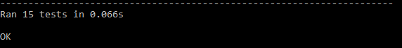
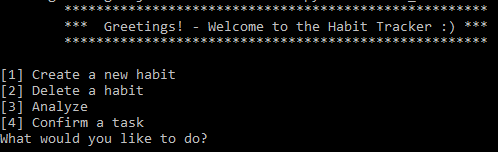

habitTrackerIU
====================================================================================    
This is a Habit tracker for the module OOFPP at the IU Internationale Hochschule.

## Installation

### habitTrackerIU requires:

- Python (>= 3.8)

### Install habitTrackerIU

1. Download the latest version of habitTrackerIU [here](https://github.com/nasch7kadse/habitTrackerIU/archive/refs/heads/main.zip)
2. Go to the download location and unzip the file
3. Switch to the "habitTrackerIU-main" folder
4. Create a virtual python environment

``` sh
$ python -m venv env
```

5. Activate your environment

``` sh
$ .\env\Scripts\activate
```

### Run tests

6. Switch to the "tests" folder
7. Run the testsuite.py

``` sh
$ python3 testsuite.py
```

You should see something like this



### Run habit tracker

8. Switch to parent folder "habitTrackerIU-main"
9. Run the start_habittracker.py

``` sh
$ python3 start_habittracker.py
```

You should see the main menu:



---
## Usage

You can navigate through the options that are displayed after entering any command.
To exit the program, enter "exit" in the main menu.

---

## License
>You can check out the full license [here](https://github.com/equitania/odoo-fast-report-mapper/blob/master/LICENSE.txt)

This project is licensed under the terms of the **AGPLv3** license.